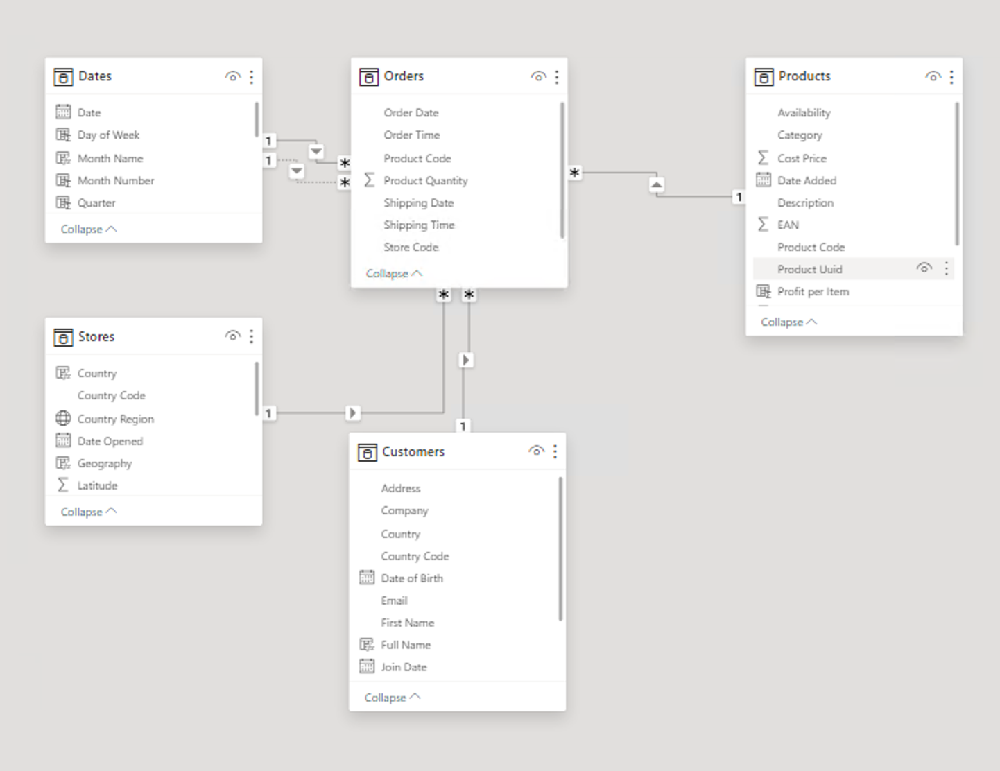
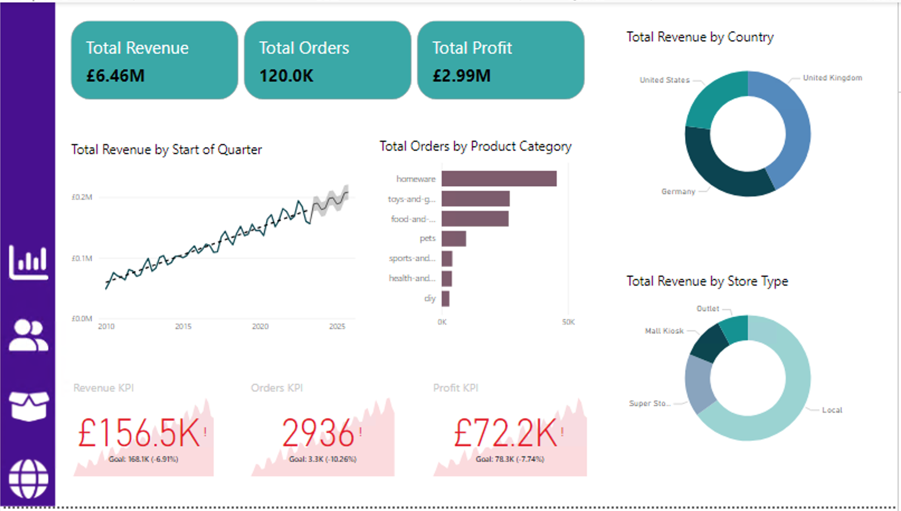
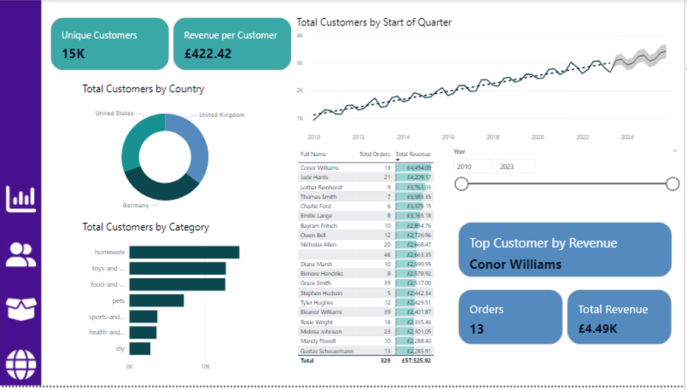
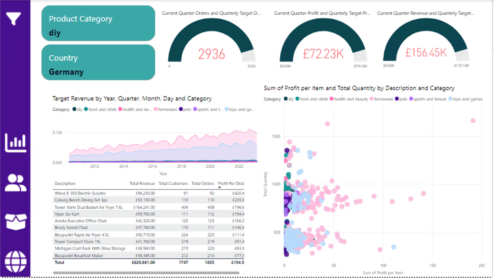
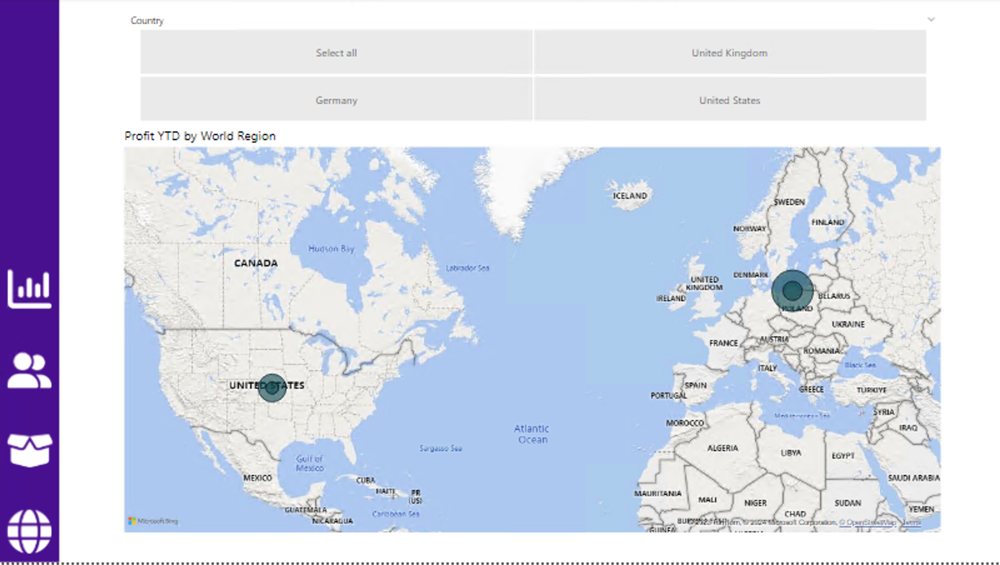
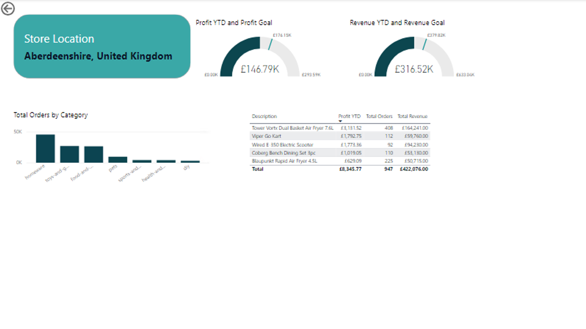
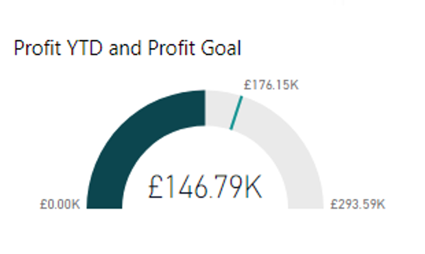

# Data Analytics Power BI Report

#### Project prompt
You have recently been approached by a medium-sized international retailer who is keen on elevating their business intelligence practices. With operations spanning across different regions, they've accumulated large amounts of sales from disparate sources over the years.

#### Project Aim
To use Power BI to:
- Import the data from various sources
- Clean the data
- Transform the data
- Create relationships between tables
- Create useful measures 
- Build a multi-page report with visuals to showcase the data in an appealing manner for different teams within the company. 

## Table of Contents 
- [File Structure](#file-structure)
- [Creating a Github environment for the project](#creating-a-github-environment-for-the-project)
- [Creating a Virtual Machine, Importing and Transforming the data](#creating-a-virtual-machine-importing-and-transforming-the-data)
  - [1 - Creating a Virtual Machine and Downloading Power BI](#1---creating-a-virtual-machine-and-downloading-power-bi)
  - [2 - Loading and Transforming the Orders table](#2---loading-and-transforming-the-orders-table)
  - [3 - Loading and Transforming the Products table](#3---loading-and-transforming-the-products-table)
  - [4 - Loading and Transforming the Stores table](#4---loading-and-transforming-the-stores-table)
  - [5 - Loading and Transforming the Customers table](#5---loading-and-transforming-the-customers-table)

- [Creating the Data Model](#creating-the-data-model)
  - [1 - Creating a Date Table](#1---creating-a-date-table)
  - [2 - Building the Star Schema Data Model](#2---building-the-star-schema-data-model)
  - [3 - Creating a measure table](#3---creating-a-measure-table)
  - [4 - Creating Key measures](#4---creating-key-measures)
  - [5 - Creating Date and Geography hierarchies](#5---creating-date-and-geography-hierarchies)

- [Setting up the Report](#setting-up-the-report)
  - [1 - Report pages](#1---report-pages)
  - [2 - Adding a Navigation Sidebar](#2---adding-a-navigation-sidebar)

- [Building a Customer Detail Page](#building-a-customer-detail-page)
  - [1 - Creating Headline Card Visuals](#1---creating-headline-card-visuals)
  - [2 - Adding Summary Charts](#2---adding-summary-charts)
  - [3 - Creating a Line Chart](#3---creating-a-line-chart)
  - [4 - Creating a Top 20 Customer table](#4---creating-a-top-20-customer-table)
  - [5 - Creating Top Customer Cards](#5---creating-top-customer-cards)
  - [6 - Adding a Data Slicer](#6---adding-a-data-slicer)

- [Building an Executive Summary Page](#building-an-executive-summary-page)
  - [1 - Creating task visuals](#1---creating-task-visuals)
  - [2 - Adding a Revenue Trending Line Chart](#2---adding-a-revenue-trending-line-chart)
  - [3 - Adding Donut charts for Total Revenue by Country and Total Revenue by Store Type](#3---adding-donut-charts-for-total-revenue-by-country-and-total-revenue-by-store-type)
  - [4 - Adding a Bar Chart of Orders by Product categories](#4---adding-a-bar-chart-of-orders-by-product-categories)
  - [5 - Adding KPI Visuals](#5---adding-kpi-visuals)

- [Building a Product Detail Page](#building-a-product-detail-page)
  - [1 - Add Gauge Visuals](#1---add-gauge-visuals)
  - [2 - Plan out the Filter State Cards](#2---plan-out-the-filter-state-cards)
  - [3 - Adding an Area Chart of Revenue by Product Category](#3---adding-an-area-chart-of-revenue-by-product-category)
  - [4 - Adding a Top Product tables](#4---adding-a-top-product-tables)
  - [5 - Adding a scatter graph of Quantity Sold vs Profit per Item](#5---adding-a-scatter-graph-of-quantity-sold-vs-profit-per-item)
  - [6 - Creating a Slicer Tool Bar](#6---creating-a-slicer-tool-bar)

- [Building a Store Map page](#building-a-store-map-page)
  - [1 - Adding a Map visual](#1---adding-a-map-visual)
  - [2 - Adding a Country Slicer](#2---adding-a-country-slicer)
  - [3 - Creating a Store Drillthrough page](#3---creating-a-store-drillthrough-page)
  - [4 - Creating a Tooltip page](#4---creating-a-tooltip-page)

- [Cross Filtering and Navigation](#cross-filtering-and-navigation)
  - [1 - Fixing the Cross Filtering](#1---fixing-the-cross-filtering)
  - [2 - Adding Navigation buttons](#2---adding-navigation-buttons)

- [Mileston 10 - Creating Metrics for users outside the company using SQL](#creating-metrics-for-users-outside-the-company-using-sql)
  - [1 - Connecting to the SQL Server](#1---connecting-to-the-sql-server)
  - [2 - Checking the table and column names](#2---checking-the-table-and-column-names)
  - [3 - Querying the database](#3---querying-the-database)

- [Images of Power BI's Report Pages](#images-of-power-bis-report-pages)

## File Structure
- Root Directory

    - csv_results
        - question_1.csv
        - question_2.csv
        - question_3.csv
        - question_4.csv
        - question_5.csv
    - README_images
        - customer_detail.png
        - executive_summary.png
        - product_detail.png
        - star_schema.png
        - store_drillthrough.png
        - stores_map.png
        - tooltip_page.png    
    - sql_queries
        - question_1.sql
        - question_2.sql
        - question_3.sql
        - question_4.sql
        - question_5.sql
    - table_columns
        - customer_columns.csv
        - dates_columns.csv
        - orders_columns.csv
        - products_columns.csv
        - stores_columns
    - power_bi_project.pbix
    - README.md

## Creating a Github environment for the project 
1. A Github environment for the project was created and connected to the local machine's VScode. 

## Creating a Virtual Machine, Importing and Transforming the data

### 1 - Creating a Virtual Machine and Downloading Power BI
- A Windows virtual machine was created on Microsoft Azure for the purpose of downloading Power BI
- A file called power_bi_project.pbix was created

### 2 - Loading and Transforming the Orders table
The Orders table is the main fact table. It contains information about each order, including the order and shipping dates, the customer, store and product IDs for associating with dimension tables, and the amount of each product ordered. Each order in this table consists of an order of a single product type, so there is only one product code per order
1. The Orders table is imported from an Azure SQL Database with the credentials provided
2. The [Card Number] column is deleted for data privacy
3. The [Order Date] and [Shipping Date] were split
4. Missing and null values on [Order Date] column were filtered out and removed
5. Columns were renamed in accordance to Power BI conventions

### 3 - Loading and Transforming the Products table
The Products table contains information about each product sold by the company, including the product code, name, category, cost price, sale price, and weight.
1. The Products table was a .csv which was downloaded and imported to Power BI. 
2. Duplicates on Product Code column were removed
3. The Weight column was cleaned and transoformed:
    - A Values and Units (kg, ml, etc) columns were created from the Weight using the Column from Example feature. 
    - Units column blank entries replaced with kg 
    - Values column blank/error entries replaced with 1
    - Values column data type converted to decimal number
    - New calculated column created  (Weight in kg) where if the Units column is not kg the value in the Values column is divided by 1000. DAX formula:
    - Weight in kg = IF(Products[Units] <> "kg", Products[Values] / 1000, Products[Values])
4. Columns that are no longer needed such as the previous weight column were deleted
5. Columns were renamed in accordance to Power BI conventions

### 4 - Loading and Transforming the Stores table
The Stores table contains information about each store, including the store code, store type, country, region, and address.
1. The Stores table is imported from an Azure Blob storage with the credentials provided
2. Columns were renamed in accordance to Power BI conventions

### 5 - Loading and Transforming the Customers table 
The Customers table contains information abot the customer, including address, date of birth, email, telephone, among others. 
1. The Customer table was downloaded from a .zip file and imported to Power BI. The table was in 3 different parts so they were appended once imported. 
2. A [Full Name] column was created combining the [First Name] and [Last Name] columns. 
3. Columns no longer needed were deleted.
4. Columns were renamed in accordance to Power BI conventions

## Creating the Data Model

### 1 - Creating a Date Table
A continuous date table is created covering the entire time period of the data. 
1. A date table running from the start of the year containing the earliest date in the Orders[Order Date] column to the end of the year containing the latest date in the Orders[Shipping Date] column is created with the following DAX formula Dates = CALENDAR(MIN(Orders[Order Date]), MAX(Orders[Shipping Date]))
2. The following column were created: 
    - Day of Week
    - Month Number (i.e. Jan = 1, Dec = 12 etc.)
    - Month Name
    - Quarter
    - Year
    - Start of Year
    - Start of Quarter
    - Start of Month
    - Start of Week
- Some examples of the DAX formulas used to create the columns:
    - Day of Week = WEEKDAY(Dates[Date])
    - Month Name = FORMAT(Dates[Date], "MMMM")
    - Start of Week = Dates[Date] - WEEKDAY(Dates[Date], 2) + 1

### 2 - Building the Star Schema Data Model
1. Relationships created between tables: 
    - Orders[product_code] to Products[product_code]
    - Orders[Store Code] to Stores[store code]
    - Orders[User ID] to Customers[User UUID]
    - Orders[Order Date] to Date[date]
    - Orders[Shipping Date] to Date[date]
- 

### 3 - Creating a measure table
- A measures table was created for future measures in the project

### 4 - Creating Key measures
The following measures were created: 
- The measure Total Orders counts the number of orders in the Orders table
- The measure Total Revenue multiplies the Orders[Product Quantity] column by the Products[Sale Price] column for each row, and then sums the result
- The measure Total Profit performs the following calculation: for each row, subtract the Products[Cost Price] from the Products[Sale Price], and then multiply the result by the Orders[Product Quantity], then 
sums the result for all rows
- The measure Total Customers counts the number of unique customers in the Orders table. 
- The measure Total Quantity counts the number of items sold in the Orders table
- The measure Profit YTD calculates the total profit for the current year
- The measure Revenue YTD calculates the total revenue for the current year

### 5 - Creating Date and Geography hierarchies
1. Date hierarchy created right clicking on the highest point of hierarchy, renaming and adding the columns lower down in order. 
    - Start of Year
    - Start of Quarter
    - Start of Month
    - Start of Week
    - Date
2. New calculated column created called Country using the Country Code column.
3. Similarly with Geography hierarchy
    - World Region
    - Country
    - Country Region
4. New column called Geography created where the Country Region and Country column are joined.
5. In the column tools the following categories were assigned:
    - World Region : Continent
    - Country : Country
    - Country Region : State or Province

## Setting up the Report

### 1 - Report pages
Report pages where added, in Model view by pressing the plus button. The pages added:
- Executive Summary
- Customer Detail
- Product Detail
- Stores Map

Also a theme was chosen in the View tab. The theme chosen was the Colorblind safe one, to have in mind a variety of viewers of the project. 
### 2 - Adding a Navigation Sidebar
- Rectangle shape added in all pages. Going from the bottom to the top of the page on the left hand side. 

## Building a Customer Detail page

### 1 - Creating Headline Card Visuals
1. Two card visuals were added one for Total customers and one for the Revenue per Customer measure (this measure was created by dividing the Total Customers / Total Revenue)
2. The Total Customers field was renamed to Unique Customers
### 2 - Adding Summary Charts
1. Donut chart visual was added using the Users[Country] column to filter the [Total Customers] measure
2. Column chart visual was created using the Products[Category] column to filter the [Total Customers] measure

### 3 - Creating a Line Chart 
1. A line chart visual was created where 
    - X axis: Date Hierarchy
    - Y axis: Total Customers measures
    Where it was selected that the user could only drill down up to Start of Month, hence deselecting Date and Start of Week on the Data pane
2. A trend line, and a forecast for the next 10 periods with a 95% confidence interval were added.
### 4 - Creating a Top 20 Customer table 
1. A visuals table was created with the following columns:
    - Customers[Full Name]
    - Total Orders measure
    - Total Revenue measure
2. A TopN Filter was applied to get the Top 20 Customers based on the Total Revenue.
### 5 - Creating Top Customer Cards
1. A card visual was added to show the top customer, selecting Full Name, Total Quantity and Total Revenue.
### 6 - Adding a Data Slicer
1. A data slicer was added. By pressing on the visual followed by selecting Year which is what we want the data to be sliced on. 

## Building an Executive Summary Page
### 1 - Creating task visuals
1. Card visuals were added
2. Total Revenue, Total Orders and Total Profit are the measures selected
3. On  Format > Callout Values we select 2 decimal points for Total Profit and Total Revenue, 1 decimal point for Total Orders
4. The formatting of the card visuals to kept the same as in the Customer Detail page

### 2 - Adding a Revenue Trending Line Chart 
1. Copying the Customer Details line graph.
2. The Y axis is changed to Total Revenue, The X axis is kept the same
### 3 - Adding Donut charts for Total Revenue by Country and Total Revenue by Store Type
1. Revenue by Country donut chart:
    - Copy donut chart from Customer detail page
    - Change Total Customers to Total Revenue 
2. Revenue by Store Type donut chart
    - Copy donut chart made on Step 1
    - Change Stores[Country] to Stores[Store Type]

### 4 - Adding a Bar Chart of Orders by Product categories
1. Clustered bar chart visual was created
    - Y axis: Products[Category]
    - X axis: Total Orders measure

### 5 - Adding KPI Visuals
1. New measures to be created in the Measures tables using DAX formulas.
    - Previous Quarter Profit ()
    - Previous Quarter Revenue
    - Previous Quarter Orders
    - Target Profit - which is 5%, this is achieved by multiplying the Previous Quarter Profit measure by 1.05. This is done respectively to both measures below. 
    - Target Revenue 
    - Target Orders
2. KPI visual is created where:
    - Value: Total Profit
    - Trend axis: Start of Quarter
    - Target: Target Profit
3. In the Format pane the Trend axis is turned on, the direction: high is good, the bad colour is set to red and the Transparency is set to 15%
4. Step 2 and 3 are repetead for revenue and orders. 

## Building a Product Detail Page
### 1 - Add Gauge Visuals
1. In the Measures Table the following measures were created:
    - Current Quarter Profit
    - Current Quarter Revenue 
    - Current Quarter Orders
    - Quarterly Target Profit - which is 10%, measure achieved by multiplying Current Quarter Profit by 1.1. This is done respectively to both measures below
    - Quarterly Target Revenue
    - Quarterly Target Orders
2. Three gauge visuals were inserted where respectively:
    - Values:
        - Current Quarter Profit
        - Current Quarter Revenue 
        - Current Quarter Orders
    - Maximum Value
        - Quarterly Target Profit
        - Quarterly Target Revenue
        - Quarterly Target Orders
3. Conditional formatting was done to the callout value of each Gauge. This is done by going to Callout Value in the Format pane and pressing the fx button the choosing Rules and the rules applied were:
    - What field should we base this on? Current Quarter Orders
    - If value >= 3299.6 (this is the Quarterly Target Orders value) and < 999999999 (largest number possible) then the colour red
    - If value >= 0 and < 3299.6 then black
    - This is done respectively to each Gauge

### 2 - Plan out the Filter State Cards
1. Add a Filter Card selecting Products[Category] and Stores[Country]
### 3 - Adding an Area Chart of Revenue by Product Category
1. An area Chart was inserted with the following fields:
    - X axis Dates[Start of Quarter]
    - Y axis Total Revenue measure
    - Legend Products[Category]

### 4 - Adding a Top Product tables 
1. A table visual is added witht he following columns selected:
    - Product Description
    - Total Revenue
    - Total Customers
    - Total Orders
    - Profit per Order (a new measure obtained by dividing Total Profit by Total Orders)
2. On the filters pane on Description the Filter Type is put to Top N, in Show Items, select Top and put the number 10, in By Value Total Revenue is chosen
### 5 - Adding a scatter graph of Quantity Sold vs Profit per Item 
1. The Profit per Item column was created in the Products table by subtracting the Sale Price by the Cost Price. The DAX formula is available in the .pbix file 
2. A Scatter chart visual is added with the following specifications:
    - Values: Products[Description]
    - X-Axis: Products[Profit per Item]
    - Y-Axis: Products[Total Quantity]
    - Legend: Products[Category]

### 6 - Creating a Slicer Tool Bar
1. A custom button is added to the Navigation bar. The custom icon is a Filter icon. The tooltip text is changed to Open Slicer Panel. 
2. A rectangle shape is added (what is going to be the slicer bar). Where the shape is the height of the page and 3 times the width of the navigation bar. The shape is brought to the top of the stacking order. 
3. Two new Slicers added
- Products[Category] - renamed: Product Category
    - Slicer set to vertical list
    - Multi-select
- Stores[Country] - renamed Country 
    - Slicer set to vertical list
    - Single select
4. A back button is added to the right top corner of the slicer bar. 
5. The Slicer bar, the back button and both slicers are grouped. By selecting them all and grouping them in the selection pane. Rename Slicer Bar Group
6. Bookmark pane opened in View tab. Two bookmarks were added 
    - Slicer Bar Closed 
        - Hide Slicer Bar Group in Selection pane by clicking the eye
        - Right click and tick off Data
    - Slicer Bar Open
        - Make sure Slicer Bar Group visible
        - Right click and tick off Data
7. Actions for the buttons were assigned where:
    - Back button: 
    - Filter button:

## Building a Store Map page
### 1 - Adding a Map visual 
1. A Map visual is added where:
    - Location: Geography Hierarchy 
    - Bubble Size: Profit YTD
    - In Format pane:
        - Show Labels: On
        - Auto Zoom: On
        - Zoom buttons: Off
        - Lasso button: Off

### 2 - Adding a Country Slicer
1. Above the Map visual a slicer visual is added where the slicer field is Stores[Country] and the slicer style is Tile. Also, the Selection settings are Multi-select with Ctrl and Show "Select All" as an option in the slicer
### 3 - Creating a Store Drillthrough page 
1. A new page called Store Drillthrough is created. In the Format pane the page type is set to drillthrough, drillthrough from: Country Region and Drillthrough when: Used as Category.
2. Two new measures are created:
- Profit Goal (20%) where the Profit YTD is multiplied by 1.2 to obtain this. DAX formula available in file. 
- Profit Revenue, same procedure as above. 
3. A table visual with the Top 5 products, the Top N filter is used top obtain the top 5 on the Total Revenue measure. The table columns are:
    - Description 
    - Profit YTD
    - Total Orders
    - Total Revenue
4. A column chart was added where: 
    - X axis: Products[Category]
    - Y axis: Total Orders measure
5. Two Guage visuals were added where:
    - Value: Profit YTD Target: Profit Goal
    - Value: Revenue YTD Target: Revenue Goal
6. A Card visual was added selecting Stores[Geography]. But, Geography is renamed to Stored Location so when selecting any item from the table visual the card shows the store Location
### 4 - Creating a Tooltip page
1. A new page called Tooltip page is created. The page type is set to Tooltip.
2. The Profit Gauge is copied and pasted from the Drillthrough page to the Tooltip page
3. In Stores Map page, on the Map visuals, Tooltips in the format page is set to On. Options:
- Type: Report Page
- Page: Tooltip Page

## Cross Filtering and Navigation
### 1 - Fixing the Cross Filtering
- Using the Edit Interaction option in the Format tab (ribbon) for the pages below. Pressing the X button when the interaction is not needed. 
1. Executive Summary page
    - Product Category bar chart to not filter card visuals or KPI visuals. 
2. Customer Detail page
    - Table visual to not interact with any other visual
    - Total Customer by Product donut chart visual to not interact with Line chart
    - Total Customers by Country donut chart to cross filter the Total Customer by Product donut chart
3. Product Detail page
    - Scatter graph to not affect any visual 
    - Table visual to not affect any visual

### 2 - Adding Navigation buttons
1. Four blank buttons were added to the navigation bar on the Executive Summary page
2. On Format pane > Button Style > Apply settings: Default. Then on Icon > Icon Type > Custom, select the button corresponding button in white (the blue option is for the hover option). Repeat this with every button. 
3. Changing the Apply settings to: On Hover and select the blue image for each button. 
4. For each button the go to Action on the Format pane, turn it on. Select the type to Page Navigation and select the appropriate page for each button.
5. Group the buttons, and copy and paste to each page. 
6. Make sure you change the Executive Summary button in the subsequent page as you can not select the same page the button is on initially

## Creating Metrics for users outside the company using SQL
### 1 - Connecting to the SQL Server
1. Using SQLTools on VSCode we connect to the Postgres database that is hosted in Microsoft Azure using details provided. 

### 2 - Checking the table and column names
1. Using a SQL querie a list of tables in the database was printed. 
2. A list of columns for each of the tables is printed and saved to .csv file. Available in table_columns directory
### 3 - Querying the database
1. The following questions were answered with SQL queries and these are available as a query (.sql) in the sql_queries directory and the result (.csv) is available in the csv_results directory. These files are labelled by question number. 
    1. How many staff are there in all of the UK stores? 13273
    2. Which month in 2022 has had the highest revenue? October
    3. Which German store type had the highest revenue for 2022? Local
    4. Create a view where the rows are the store types and the columns are the total sales, percentage of total sales and the count of orders. Answer in csv_results
    5. Which product category generated the most profit for the "Wiltshire, UK" region in 2021? Homeware

## Images of Power BI's Report Pages
- 
- 
- 
- 
- 
- 

